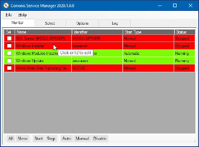

What is Corionis Service Manager?

The Corionis Service Manager (CSM) is a small Windows tray application that 
monitors and manages a list of user-selected Windows services. The selected 
services are monitored and may be started, stopped, the start-up 
type changed, etc.

Most people who regularly monitor and manage Windows services are only 
interested in a few. Because CSM is a Windows tray app it is always 
available. The utility may be popped up or down by double-clicking the 
tray icon. Notifications are displayed and logged when a 
selected service's state changes.

 
CSM is free and Open Source distributed under the [MIT license](https://opensource.org/licenses/MIT).

Features

 * Monitors and manages a list of user-selected Windows services.
 * Monitored services may be reordered on the Monitor tab with drag 'n drop.
 * Monitored service names may be edited.
 * Monitor and Select lists have sortable columns.
 * Select tab shows all Windows services available on the system.
 * Logs running status changes of selected services.
 * Optional logging to a file.
